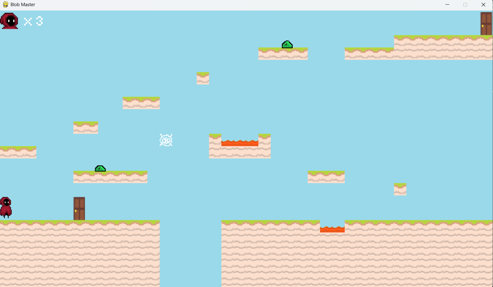

# Blob Master

A 2D platformer built in Python with **Pygame**. Guide the character past lava and cobwebs, avoid enemies "blobs", and reach the door at the end of each level to move to the next level — all in maps you can build and edit with the built-in level editor.



## Features

- Platformer physics (gravity, jumping, ground collisions)
- Lives system with level restart on death
- Enemies (Blob) with their own animations and logic
- Special tiles: lava (damage), cobwebs (slow you down), doors (level exit)
- Built-in **level editor** — create, save, and load your own maps

## Requirements

- Python 3.10+
- Pygame

```bash
pip install pygame
```

## Running the game

```bash
git clone <repo-url>
cd 2D_Game
python main.py
```

## Controls

| Key       | Action                  |
|-----------|-------------------------|
| A / D     | Move left / right       |
| Space     | Jump                    |
| Esc       | Pause / menu            |
| O / P     | Fade in music / Fade out music|

### Level editor

| Key           | Tile                   |
|---------------|------------------------|
| 1             | Dirt                   |
| 2             | Grass                  |
| 3             | Plant                  |
| 4             | Lava                   |
| 5             | Door                   |
| 6             | Cobweb                 |
| 7             | Player start point     |
| 8             | Blob (enemy)           |
| Left click    | Place tile             |
| Right click   | Remove tile            |

In editor mode you can save the map (`save`), load a custom level file (`upload`), clear the board (`clear`), and toggle the helper grid (`grid`).

## Project structure

```
.
├── main.py            # core game, editor and rendering logic
├── images/            # sprites, tiles, button graphics
├── font/              # extra assets (e.g. Minecraft.ttf font)
└── level*.txt         # saved game levels
```
